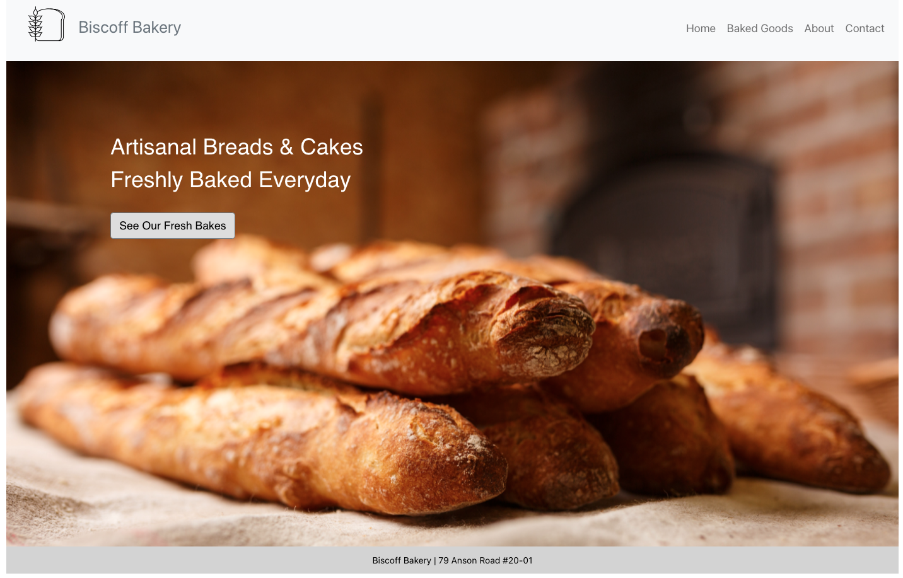
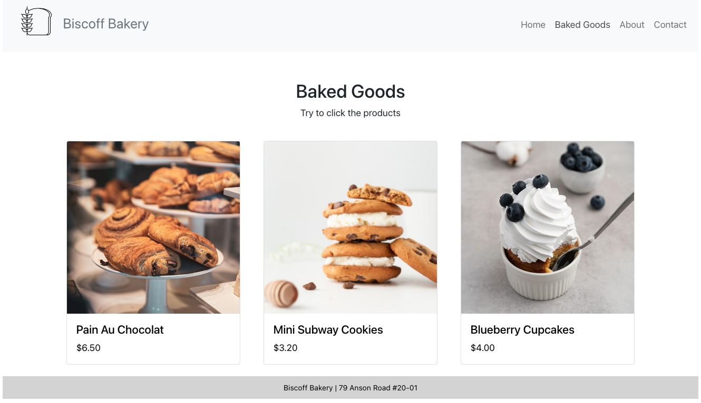

## Biscoff Bakery ver2.0 (with React)

This project was bootstrapped with [Create React App](https://github.com/facebook/create-react-app).

To start the project, you can run: `yarn start`

### Challenges that I didn't manage to solve:

1. There are 2 images folder in `/public` and `/src/images`. This because I cannot change the PATH of `.mainpage-background` in App.scss (row 74) into `/public` folder.

1. I tried to create `utils/database.js` to contain initial data, then I plan to push the data into `BakedGoods.jsx` componentDidMound().
    - But, I kept seeing the `this.state.cake is undefined` even after componentDidMount()
    - Since it didn't work, I put the array manually inside the `BakedGoods.jsx`

